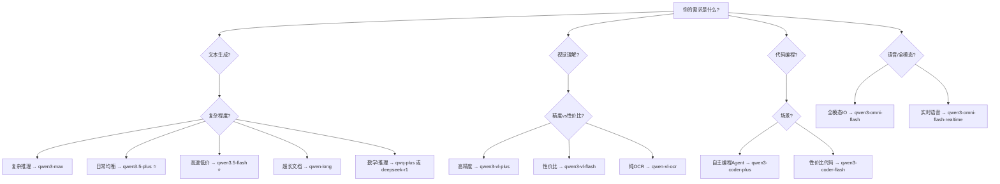

# 🧠 阿里云百炼 — 核心模型精选速查表

> **数据来源**: [阿里云百炼模型列表](https://help.aliyun.com/zh/model-studio/models)
> **定价基准**: 中国内地部署模式（北京地域），单位：元/百万Token
> **最后更新**: 2026-03

---

## 📊 核心维度速览

| 维度 | 冠军模型 | 关键指标 |
|------|---------|---------|
| 🏆 **最强综合** | `qwen3-max` | 复杂推理、多步骤任务，262K上下文 |
| 🧮 **最强推理** | `deepseek-r1` / `qwq-plus` | 数学/代码推理达 SOTA 水平 |
| ⚡ **最高性价比** | `qwen3.5-flash` | 输入0.2元/输出2元，1M上下文 |
| 🆓 **免费之王** | `qwen-turbo` | 0.3元入/0.6元出，有免费额度 |
| 💻 **最强代码** | `qwen3-coder-plus` / `qwen3-coder-next` | 工具调用+环境交互，1M上下文 |
| 👁️ **最强视觉** | `qwen3-vl-plus` / `qwen3.5-plus`(多模态) | 图文+视频理解，思考模式 |
| 🌐 **超长上下文** | `qwen-long` | 10M Token上下文！0.5元入/2元出 |
| 🗣️ **全模态** | `qwen3-omni-flash` | 文本+图+音+视频输入/语音输出 |
| 🌍 **最强翻译** | `qwen-mt-plus` | 92语种互译，1.8元入/5.4元出 |

---

## 一、🔤 文本生成 — 千问商业版（旗舰）

> [!IMPORTANT]
> 商业版具有更新的能力和优化，推荐优先使用稳定版。

### 1. 千问Max — 最强能力

| 模型名称 | 上下文 | 输入价格 | 输出价格 | 特性 | 免费额度 |
|---------|--------|---------|---------|------|---------|
| `qwen3-max` | 262K | 2.5元(≤32K) → 7元(≤252K) | 10元(≤32K) → 28元(≤252K) | 思考/非思考模式，Batch半价，上下文缓存，联网搜索 | 各100万Token(90天) |

> **适用**: 复杂推理、多步骤任务、高质量文本生成
> **思考模式**新增 Web搜索 + 网页提取 + 代码解释器三项内置工具

### 2. 千问Plus — 最佳均衡 ⭐推荐

| 模型名称 | 上下文 | 输入价格 | 输出价格 | 特性 | 免费额度 |
|---------|--------|---------|---------|------|---------|
| `qwen3.5-plus` | **1M** | 0.8元(≤128K) → 4元(≤1M) | 4.8元(≤128K) → 24元(≤1M) | 默认思考模式，**支持文本+图像+视频输入**，纯文本媲美Max | 各100万Token(90天) |
| `qwen-plus` (Qwen3) | **1M** | 0.8元(≤128K) → 4.8元(≤1M) | 非思考2元/思考8元(≤128K) | 思考/非思考切换 | 各100万Token(90天) |

> **适用**: 日常对话、中等复杂任务、性价比首选
> **亮点**: Qwen3.5 Plus 多模态能力超越 Qwen3 VL 系列

### 3. 千问Flash — 极速低价 ⭐性价比王

| 模型名称 | 上下文 | 输入价格 | 输出价格 | 特性 | 免费额度 |
|---------|--------|---------|---------|------|---------|
| `qwen3.5-flash` | **1M** | **0.2元**(≤128K) → 1.2元(≤1M) | **2元**(≤128K) → 12元(≤1M) | 默认思考，Batch半价 | 各100万Token(90天) |
| `qwen-flash` (Qwen3) | **1M** | **0.15元**(≤128K) → 1.2元(≤1M) | **1.5元**(≤128K) → 12元(≤1M) | 思考/非思考切换 | 各100万Token(90天) |

> **适用**: 简单任务、高并发场景、成本敏感型应用
> **Qwen-Flash 是目前百炼最低价模型之一**

### 4. 千问Turbo — 经济实惠（不再更新，推荐迁移Flash）

| 模型名称 | 上下文 | 输入价格 | 输出价格 | 特性 | 免费额度 |
|---------|--------|---------|---------|------|---------|
| `qwen-turbo` (Qwen3) | 非思考1M / 思考131K | 0.3元 | 非思考0.6元/思考3元 | Batch半价 | 各100万Token(90天) |

### 5. 千问Long — 超长上下文专家

| 模型名称 | 上下文 | 输入价格 | 输出价格 | 特性 | 免费额度 |
|---------|--------|---------|---------|------|---------|
| `qwen-long` | **10M** ❗ | 0.5元 | 2元 | 长文本分析/摘要/分类 | 各100万Token(90天) |

> **适用**: 超长文档分析、全书总结、大规模信息抽取

---

## 二、🧮 推理模型

### QwQ — 强化学习推理 ⭐推理之王

| 模型名称 | 上下文 | 输入价格 | 输出价格 | 特性 | 免费额度 |
|---------|--------|---------|---------|------|---------|
| `qwq-plus` | 131K | 1.6元 | 4元 | 数学/代码核心指标达DeepSeek-R1满血版水平 | 各100万Token(90天) |
| `qwq-32b` (开源) | 131K | 2元 | 6元 | 超越DeepSeek-R1-Distill-Qwen-32B | 100万Token(90天) |

---

## 三、💻 代码模型

### 千问Coder

| 模型名称 | 上下文 | 输入价格 | 输出价格 | 特性 | 免费额度 |
|---------|--------|---------|---------|------|---------|
| `qwen3-coder-plus` | **1M** | 4元(≤32K) → 20元(≤1M) | 16元(≤32K) → 200元(≤1M) | 工具调用+环境交互，自主编程 | 各100万Token(90天) |
| `qwen3-coder-flash` | **1M** | 1元(≤32K) → 5元(≤1M) | 4元(≤32K) → 25元(≤1M) | 性价比代码模型 | 各100万Token(90天) |
| `qwen3-coder-next` (开源) | 262K | 1元(≤32K) | 4元(≤32K) | 最新开源Coder | 各100万Token(90天) |
| `qwen3-coder-480b-a35b-instruct` (开源) | 262K | 6元(≤32K) | 24元(≤32K) | 480B满血版 | 各100万Token(90天) |

---

## 四、👁️ 视觉与多模态

### 千问VL — 视觉理解

| 模型名称 | 上下文 | 输入价格 | 输出价格 | 特性 | 免费额度 |
|---------|--------|---------|---------|------|---------|
| `qwen3-vl-plus` | 262K | 1元(≤32K) → 3元(≤256K) | 10元(≤32K) → 30元(≤256K) | 思考模式，OCR+视频理解+视觉推理 | 各100万Token(90天) |
| `qwen3-vl-flash` | 262K | **0.15元**(≤32K) → 0.6元(≤256K) | **1.5元**(≤32K) → 6元(≤256K) | 思考模式，性价比视觉模型 | 各100万Token(90天) |

### QVQ — 视觉推理

| 模型名称 | 上下文 | 输入价格 | 输出价格 | 特性 | 免费额度 |
|---------|--------|---------|---------|------|---------|
| `qvq-max` | 131K | 8元 | 32元 | 数学+编程+视觉分析+创作 | 各100万Token(90天) |
| `qvq-plus` | 131K | 2元 | 5元 | 性价比视觉推理 | 各100万Token(90天) |

### 千问OCR — 文字提取专家

| 模型名称 | 上下文 | 输入价格 | 输出价格 | 特性 | 免费额度 |
|---------|--------|---------|---------|------|---------|
| `qwen-vl-ocr` | 38K | **0.3元** | **0.5元** | 多语言OCR，表格/手写体识别 | 各100万Token(90天) |

### 千问Omni — 全模态

| 模型名称 | 上下文 | 定价 | 特性 | 免费额度 |
|---------|--------|------|------|---------|
| `qwen3-omni-flash` | 65K | 文本入1.8元/音频入15.8元/图视入3.3元 | 文本+图+音频+视频输入，文本/语音输出，**49种音色**，10种语言 | 各100万Token |
| `qwen3-omni-flash-realtime` | 65K | 文本入2.2元/音频入18.9元 | 支持音频流式输入+内置VAD | 各100万Token |

---

## 五、🌐 第三方模型（重点）

### DeepSeek — 最强开源推理 ⭐

| 模型名称 | 上下文 | 输入价格 | 输出价格 | 特性 | 免费额度 |
|---------|--------|---------|---------|------|---------|
| `deepseek-v3.2` | 131K | **2元** | **3元** | 685B满血，上下文缓存 | 各100万Token(90天) |
| `deepseek-r1` | 131K | 4元 | 16元 | 685B满血推理模型，Batch半价 | 各100万Token(90天) |
| `deepseek-v3.1` | 131K | 4元 | 12元 | 685B满血版 | 各100万Token(90天) |
| `deepseek-r1-distill-qwen-32b` | 32K | 2元 | 6元 | 蒸馏版推理模型 | 各100万Token(90天) |

> **DeepSeek-V3.2 是目前最具性价比的大参数模型之一！**

### Kimi — 超强代码与Agent ⭐

| 模型名称 | 上下文 | 输入价格 | 输出价格 | 特性 | 免费额度 |
|---------|--------|---------|---------|------|---------|
| `kimi-k2.5` | 262K | 4元 | 思考21元/非思考21元 | 思考/非思考模式，最新旗舰 | 各100万Token(90天) |
| `kimi-k2-thinking` | 262K | 4元 | 16元 | 思考推理 | 各100万Token(90天) |
| `Moonshot-Kimi-K2-Instruct` | 131K | 4元 | 16元 | 编码+工具调用 | 各100万Token(90天) |

### GLM — 智谱AI Agent专家 ⭐

| 模型名称 | 上下文 | 输入价格 | 输出价格 | 特性 | 免费额度 |
|---------|--------|---------|---------|------|---------|
| `glm-5` | 202K | 4元(≤32K) → 6元(≤198K) | 18元(≤32K) → 22元(≤198K) | 混合推理，思考/非思考同价 | 各100万Token(90天) |
| `glm-4.5-air` | 131K | **0.8元**(≤32K) | **6元**(≤32K) | 性价比GLM | 各100万Token(90天) |

### MiniMax — 多语言编程 Agent

| 模型名称 | 上下文 | 输入价格 | 输出价格 | 特性 | 免费额度 |
|---------|--------|---------|---------|------|---------|
| `MiniMax-M2.5` | 204K | 2.1元 | 8.4元 | 多语言编程+Agent任务 | 100万Token(90天) |

---

## 六、🌍 专业领域模型

| 领域 | 模型名称 | 输入/输出价格 | 用途 |
|------|---------|-------------|------|
| 🌐 **翻译** | `qwen-mt-plus` | 1.8元/5.4元 | 92语种互译，术语定制 |
| 🌐 **翻译(快)** | `qwen-mt-flash` | 0.7元/1.95元 | 高速翻译 |
| 🌐 **翻译(轻)** | `qwen-mt-lite` | 0.6元/1.6元 | 最低价翻译 |
| 📐 **数学** | `qwen-math-plus` | 4元/12元 | 数学解题专家 |
| ⛏️ **数据挖掘** | `qwen-doc-turbo` | 0.6元/1元 | 结构化信息提取 |
| 🔍 **深度研究** | `qwen-deep-research` | 54元/163元 | 拆解复杂问题+联网搜索 |
| 💬 **对话分析** | `tongyi-xiaomi-analysis-flash` | 0.2元/0.4元 | 质检/意图/满意度分析 |

---

## 七、🎨 图像生成精选

| 模型名称 | 单价 | 特色 | 免费额度 |
|---------|------|------|---------|
| `qwen-image-2.0-pro` | 0.5元/张 | 中英文字渲染最强，高清写实 | 100张(90天) |
| `qwen-image-2.0` | 0.2元/张 | 性价比文生图 | 100张(90天) |
| `z-image-turbo` | 0.1元/张(基础) | 轻量极速，中英双语渲染 | 100张(90天) |
| `wan2.6-t2i` | 0.2元/张 | 万相最新版，自由选尺寸 | 50张(90天) |
| `qwen-image-edit-max` | 0.5元/张 | 风格迁移、文字修改、物体编辑 | 100张(90天) |

---

## 八、📹 视频生成精选

> [!NOTE]
> 视频模型定价较高，建议根据实际需求选用。详见原文档视频部分。

| 功能 | 推荐模型 | 说明 |
|------|---------|------|
| 文生视频 | `wan2.1-t2v-turbo` / `wan2.6` | 一句话生成视频 |
| 图生视频 | `wan2.6-i2v` | 首帧/首尾帧生视频 |
| 数字人 | `万相-数字人` | 图+音频生对口型视频 |

---

## 九、🔢 向量模型

| 模型名称 | 维度 | 价格 | 用途 |
|---------|------|------|------|
| `text-embedding-v3` | 1024 | 0.7元/百万Token | 搜索/聚类/推荐 |
| `text-embedding-v2` | 1536 | 0.7元/百万Token | 搜索/聚类/推荐 |

---

## 十、🏆 选型决策树

---

## 十一、💰 成本优化技巧

> [!TIP]
> 1. **Batch调用半价** — 大部分千问系列支持，非实时场景必用
> 2. **上下文缓存** — 命中缓存享折扣（隐式20%/显式10%原价）
> 3. **阶梯计费** — 短输入更便宜，尽量控制单次请求Token数≤32K
> 4. **免费额度** — 每个模型开通后90天内有100万Token免费额度
> 5. **思考模式按需开** — 简单任务用非思考模式，输出价格显著更低
> 6. **DeepSeek-V3.2** — 第三方最具性价比（2元入/3元出，685B满血）

---

## 十二、⚠️ 重要注意事项

> [!WARNING]
> - 千问Turbo **不再更新**，请迁移至 Flash
> - `qwen-audio-turbo` 免费体验到期后**不可调用**，用 `qwen3-omni-flash` 替代
> - 小参数开源模型（≤1.5B）多数为**限时免费/免费体验后不可调用**
> - 国际/全球部署价格约为中国内地的 **1.5-3.5倍**
> - 第三方模型（DeepSeek/Kimi/GLM/MiniMax）仅支持**中国内地部署**
